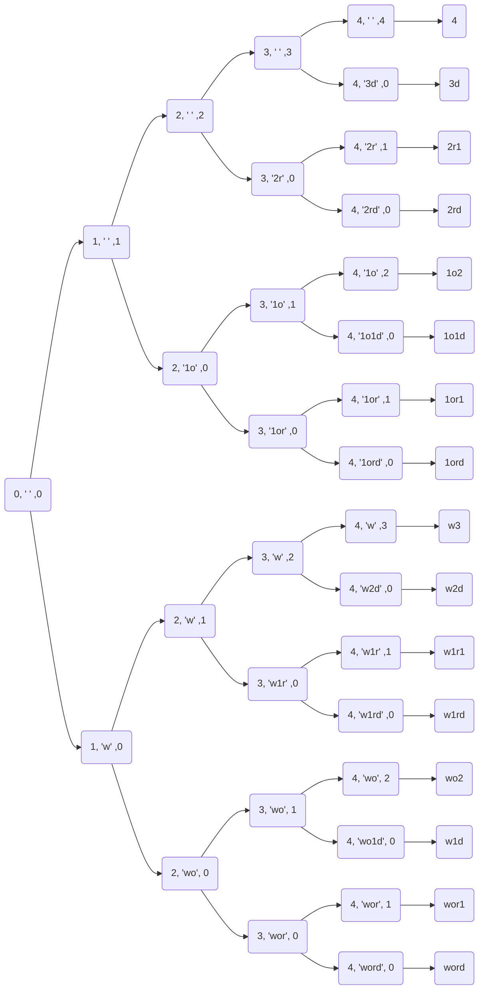

> Solving a backtracking problem is actually a traversal process of a decision tree. [^1]

<!-- more -->

</br>

## Backtracking Algorithm vs DFS

| Terminology      | Explanation                                                  |
| ---------------- | ------------------------------------------------------------ |
| decision tree    | A tree that represents a function that takes a vector of attribute values as input and returns a "decision" (a single output value) |
| ending condition | The condition that ends the growth of decision tree          |
| path             | A series of selection have been made so far                  |
| pruning          | The elimination of a large group of possibilities in one step |
| selection list   | A list of choices you may choose at the moment               |

</br>

|                                 | Backtracking Algorithm                                       | DFS                                                          |
| ------------------------------- | ------------------------------------------------------------ | ------------------------------------------------------------ |
| Definition                      | *Backtracking algorithm* is an algorithm design technique that uses pruning while traversing paths of a decision tree. | *Depth-First Search* is a generalization of preorder traversal which can be applied to graph. |
| Data Structure for Search Space | Implicit Tree. They are generally large, but pruning allows us to have significant savings over a brute-force exhaustive search. Since the tree is generated dynamically during computation, we need to consider ending condition as well as backtrack strategy together with selection list. | Tree/Graph                                                   |
| Use of memory                   | If repeated calculation are found, then we could try to see if we could solve it bottom-up(dynamic programming) or use some extra memo to record those value. | Record visited node to avoid loop traverse. Record starting time and finishing time to identify the relationship between two nodes. |

</br>

```java
results = []
void backtrack(path, selectionList) {
	if(/* ending condition */) {
        results.add(path);
        return;
    }
    for(selection : selectionList) {
        // makes a selection
        backtrack(path, selectionList);
        // undo the selection
    }
}
```

</br>

```java
results = []
void backtrack(path, selectionList, curIndex) {
	if(/* ending condition */) {
        results.add(path);
        return;
    }
    
    // Generate path without choosing current index 
    backtrack(path, selectionList, curIndex + 1);
    
    // Generate path with current index been chosen
    path.add(selectionList[curIndex]);  // select current choice
    backtrack(path, selectionList, curIndex + 1);
    path.remove(path.size() - 1)	    // undo the selection
    }
}
```


## Exercises

<a name="excercises"></a>

| #    | Title                                 | Level  | Solution                    |
| ---- | ------------------------------------- | ------ | --------------------------- |
| 78   | Subsets                               | Medium | <a href="#78">Solution</a>  |
| 90   | Subsets II                            | Medium | <a href="#90">Solution</a>  |
| 77   | Combinations                          | Medium | <a href="#77">Solution</a>  |
| 39   | Combination Sum                       | Medium | <a href="#39">Solution</a>  |
| 40   | Combination Sum II                    | Medium | <a href="#40">Solution</a>  |
| 216  | Combination Sum III                   | Medium | <a href="#216">Solution</a> |
| 46   | Permutations                          | Medium | <a href="#46">Solution</a>  |
| 47   | Permutations II                       | Medium | <a href="#47">Solution</a>  |
| 17   | Letter Combinations of a Phone Number | Medium | <a href="#17">Solution</a>  |
| 22   | Generate Parentheses                  | Medium | <a href="#22">Solution</a>  |
| 79   | Word Search                           | Medium | <a href="#79">Solution</a>  |
| 93   | Restore IP Addresses                  | Medium | <a href="#93">Solution</a>  |
| 131  | Palindrome Partitioning               | Medium | <a href="#131">Solution</a> |
| 254  | Factor Combinations                   | Medium | <a href="#254">Solution</a> |
| 306  | Additive Number                       | Medium | <a href="#306">Solution</a> |
| 320  | Generalized Abbreviation              | Medium | <a href="#320">Solution</a> |
| 351  | Android Unlock Patterns               | Medium | <a href="#351">Solution</a> |
| 37   | Sudoku Solver                         | Hard   | <a href="#37">Solution</a>  |
| 51   | N-Queens                              | Hard   | <a href="#51">Solution</a>  |
| 52   | N-Queens II                           | Hard   | <a href="#52">Solution</a>  |
| 291  | Word Pattern II                       | Hard   | <a href="#291">Solution</a> |
| 140  | Word Break II                         | Hard   | <a href="#140">Solution</a> |
| 10   | Regular Expression Matching           | Hard   | <a href="#10">Solution</a>  |
| 44   | Wildcard Matching                     | Hard   | <a href="#44">Solution</a>  |
| 301  | Remove Invalid Parentheses            | Hard   |                             |
| 282  | Expression Add Operations             | Hard   |                             |

</br>

## Solution

<a name = "17"></a>

### 17. Letter Combinations of a Phone Number

```java
public class Solution {
    public ArrayList<String> letterCombinations(String digits) {
        ArrayList<String> result = new ArrayList<String>();

        if (digits == null || digits.equals("")) {
            return result;
        }

        Map<Character, char[]> map = new HashMap<Character, char[]>();
        map.put('2', new char[] { 'a', 'b', 'c' });
        map.put('3', new char[] { 'd', 'e', 'f' });
        map.put('4', new char[] { 'g', 'h', 'i' });
        map.put('5', new char[] { 'j', 'k', 'l' });
        map.put('6', new char[] { 'm', 'n', 'o' });
        map.put('7', new char[] { 'p', 'q', 'r', 's' });
        map.put('8', new char[] { 't', 'u', 'v'});
        map.put('9', new char[] { 'w', 'x', 'y', 'z' });

        StringBuilder sb = new StringBuilder();
        helper(map, digits, sb, result);

        return result;
    }

    private void helper(Map<Character, char[]> map, String digits, 
        StringBuilder sb, ArrayList<String> result) {
        if (sb.length() == digits.length()) {
            result.add(sb.toString());
            return;
        }

        for (char c : map.get(digits.charAt(sb.length()))) {
            sb.append(c);
            helper(map, digits, sb, result);
            sb.deleteCharAt(sb.length() - 1);
        }
    }
}
```

<a href="#excercises">Back to Excercises</a>

</br>

</br>

<a name="22"></a>

### 22. Generate Parentheses

```java
class Solution {
    List<String> results = new LinkedList<String>();
    public List<String> generateParenthesis(int n) {
        backtrack(new StringBuilder("("), 1, 0, n);
        return results;
    }
    private void backtrack(StringBuilder str, int l, int r, int len) {
        if(l == len && r == len) {
            results.add(str.toString());
            return;
        }
        if(l < len) {
            str.append('(');
            backtrack(str, l + 1, r, len);
            str.deleteCharAt(str.length() - 1);
        }
        if(r < len && l > r) {
            str.append(')');
            backtrack(str, l, r + 1, len);
            str.deleteCharAt(str.length() - 1);
        }
    }
}
```

<a href="#excercises">Back to Excercises</a>

</br>

</br>

<a name="37"></a>

### 37. Sudoku Solver

```java
public class Solution {
    boolean[][] row = new boolean[9][9 + 1];
    boolean[][] col = new boolean[9][9 + 1];
    boolean[][][] block = new boolean[3][3][9 + 1];
    public void solveSudoku(int[][] board){
        int i, j, k;
        for (i = 0; i < 9; ++i) {
            for (j = 1; j <= 9; ++j) {
                row[i][j] = col[i][j] = false;
            }
        }

        for (i = 0; i < 3; ++i) {
            for (j = 0; j < 3; ++j) {
                for (k = 1; k <= 9; ++k) {
                    block[i][j][k] = false;
                }
            }
        }

        for (i = 0; i < 9; ++i) {
            for (j = 0; j < 9; ++j) {
                if (board[i][j] != 0) {
                    k = board[i][j];
                    row[i][k] = col[j][k] = true;
                    block[i / 3][j / 3][k] = true;
                }
            }
        }

        solve(board, 0, 0);
    }

    public boolean solve(int[][] board, int i, int j) {
        if (i == 9) {
            return true;
        }

        if (j == 9) {
            return solve(board, i + 1, 0);
        }

        if (board[i][j] != 0) {
            return solve(board, i, j + 1);
        }

        int k;
        for (k = 1; k <= 9; ++k) {
            if (!row[i][k] && !col[j][k] && !block[i/3][j/3][k]) {
                row[i][k] = col[j][k] = block[i/3][j/3][k] = true;
                board[i][j] = k;
                if (solve(board, i, j + 1)) {
                    return true;
                }
                
                board[i][j] = 0;
                row[i][k] = col[j][k] = block[i/3][j/3][k] = false;
            }
        }

        return false;
    }
}
```

<a href="#excercises">Back to Excercises</a>

</br>

</br>

<a name="39"></a>

### 39. Combination Sum

```java
class Solution {
    List<List<Integer>> results = new LinkedList<List<Integer>>();
    
    public List<List<Integer>> combinationSum(int[] candidates, int target) {
        backtrack(candidates, 0, 0, new LinkedList<Integer>(), target);
        return results;
    }
    
    private void backtrack(int[] candidates, int start, int sum, List<Integer> combination, int target) {
        if(sum == target) {
            results.add(new LinkedList<Integer>(combination));
            return;
        }
        for(int i = start; i<candidates.length; ++i) {
            int s = sum + candidates[i];
            if(s <= target) {
                combination.add(candidates[i]);
                backtrack(candidates, i, s, combination, target);
                combination.remove(combination.size() - 1);
            }
        }
    }
}
```

<a href="#excercises">Back to Excercises</a>

</br>

</br>

<a name="40"></a>

### 40. Combination Sum II

```java
class Solution {    
    List<List<Integer>> results = new LinkedList<List<Integer>>();
    
    public List<List<Integer>> combinationSum2(int[] candidates, int target) {
        Arrays.sort(candidates);
        backtrack(candidates, 0, 0, new LinkedList<Integer>(), target);
        return results;
    }
    
    private void backtrack(int[] candidates, int start, int sum, List<Integer> combination, int target) {
        if(sum == target) {
            results.add(new LinkedList<Integer>(combination));
            return;
        }
        for(int i = start; i<candidates.length; ++i) {
            if(i == start || candidates[i] != candidates[i - 1]) {
                int s = sum + candidates[i];
                if(s <= target) {
                    combination.add(candidates[i]);
                    backtrack(candidates, i + 1, s, combination, target);
                    combination.remove(combination.size() - 1);
                }
            }
        }
    }   
}
```

<a href="#excercises">Back to Excercises</a>

</br>

</br>

<a name="46"></a>

### 46. Permutations

```java
class Solution {
    List<List<Integer>> results = new LinkedList<List<Integer>>();
    public List<List<Integer>> permute(int[] nums) {
        if(nums.length == 0) return results;
        List<Integer> choices = new ArrayList<Integer>();
        for(int i = 0; i<nums.length; ++i) choices.add(nums[i]);
        backtrack(choices, new LinkedList<Integer>());
        return results;
    }
    
    private void backtrack(List<Integer> choices, List<Integer> permutation) {
        if(permutation.size() == choices.size()) {
            results.add(new LinkedList<Integer>(permutation));
            return;
        }
        for(int i = 0; i<choices.size(); ++i) {
            int choice = choices.get(i);
            if(permutation.contains(choice)) {
                continue;
            }
            permutation.add(choice);
            backtrack(choices, permutation);
            permutation.remove(permutation.size() - 1);
        }
    }
}
```

#### Complexity

- Runtime Complexity: $O(N!)$
- Space Complexity: $O(N)$ 

<a href="#excercises">Back to Excercises</a>

</br>

</br>

<a name="47"></a>

### 47. Permutations II

```java
class Solution {
    List<List<Integer>> results = new LinkedList<List<Integer>>();
    public List<List<Integer>> permuteUnique(int[] nums) {
        Arrays.sort(nums);
        if(nums.length == 0) return results;
        List<Integer> choices = new ArrayList<Integer>();
        for(int i = 0; i<nums.length; ++i) choices.add(nums[i]);
        backtrack(choices, new LinkedList<Integer>());
        return results;
    }
    
    private void backtrack(List<Integer> choices, List<Integer> permutation) {
        if(choices.size() == 0) {
            results.add(new LinkedList<Integer>(permutation));
            return;
        }
        for(int i = 0; i<choices.size(); ++i) {
            if(i == 0 || choices.get(i) != choices.get(i - 1)) {
                int choice = choices.get(i);
                permutation.add(choice);
                choices.remove(i);
                backtrack(choices, permutation);
                choices.add(i, choice);
                permutation.remove(permutation.size() - 1);
            }
        }
    }
}
```

#### Complexity

- Runtime Complexity: $O(N!)$
- Space Complexity: $O(N)$ 

<a href="#excercises">Back to Excercises</a>

</br>

</br>

<a name="51"></a>

### 51. N-Queens[^3]

```java
class Solution {
    public String getString(int n, int col){
        String str = "";
        for(int j=0;j<n;j++){
            str += (j==col) ? "Q" : ".";              
        }
        return str;
    }
    public boolean isValidPlace(List<Integer> places,int col){
        int row = places.size();
        for(int i=0;i<row;i++){
            int temp = Math.abs(places.get(i) - col);
            if(temp == 0 || temp == row-i)
                return false;
        }
        return true;
    }
    public void solveNQueens(int n, int row, LinkedList<Integer> places, List<List<String>> res){
        if(row == n){
            ArrayList<String> list = new ArrayList<>();
            for(int col : places){
                list.add(getString(n, col));
            }
            res.add(list);
            return ;
        }
        for(int i=0;i<n;i++){
            if(isValidPlace(places, i)){
                places.add(i);
                solveNQueens(n, row+1, places, res);
                places.removeLast();
            }
        }
    }
    public List<List<String>> solveNQueens(int n) {
        List<List<String>> res = new LinkedList<>();
        solveNQueens(n, 0, new LinkedList<>(), res);
        return res;
    }
}
```

<a href="#excercises">Back to Excercises</a>

</br>

</br>

<a name="52"></a>

### 52. N-Queens II[^4]

```java
class Solution {
    public boolean isValidPlace(List<Integer> places, int col){
        int row = places.size();
        for(int i=0;i<row;i++){
            int diff = Math.abs(places.get(i) - col);
            if(diff == 0 || diff == row - i) return false;
        }
        return true;
    }
    public int totalWays(int n, int row, LinkedList<Integer> places, int count){
        if(n == row) return 1;
        int ways = 0;
        for(int i=0;i<n;i++){
            if(isValidPlace(places, i)){
                places.add(i);
                ways += totalWays(n, row+1, places, count);
                places.removeLast();
            }
        }
        return ways;
    }
    public int totalNQueens(int n) {
        return totalWays(n, 0, new LinkedList<>(), 0);
    }
}
```

<a href="#excercises">Back to Excercises</a>

</br>

</br>

<a name="77"></a>

### 77. Combinations

```java
class Solution {
    List<List<Integer>> results = new LinkedList<List<Integer>>();
    public List<List<Integer>> combine(int n, int k) {
        backtrack(1, n, new LinkedList<Integer>(), k);
        return results;
    }
    
    private void backtrack(int start, int end, List<Integer> combination, int k) {
        if(combination.size() == k) {
            results.add(new LinkedList<Integer>(combination));
            return;
        }
        for(int i = start; i <= end; ++i) {
            combination.add(i);
            backtrack(i + 1, end, combination, k);
            combination.remove(combination.size() - 1);
        }
    }
}
```

#### Complexity

- Runtime Complexity: $O(k \times C_k^n)$ 
- Space Complexity: $O(k)$ 

<a href="#excercises">Back to Excercises</a>

</br>

</br>

<a name="78"></a>

### 78. Subset

```java
class Solution {
    List<List<Integer>> results = new LinkedList<List<Integer>>();
    public List<List<Integer>> subsets(int[] nums) {
        backtrack(nums, 0, new LinkedList<Integer>());
        return results;
    }
    
    private void backtrack(int[] nums, int index, List<Integer> subset) {
        results.add(new LinkedList<Integer>(subset));
        for(int i = index; i<nums.length; ++i) {
            subset.add(nums[i]);
            backtrack(nums, i + 1, subset);
            subset.remove(subset.size() - 1);
        }
    }
}
```

#### Complexity

- Runtime Complexity: $O(2^N)$
- Space Complexity: $O(2^N)$

<a href="#excercises">Back to Excercises</a>

</br>

</br>

<a name="79"></a>

### 79. Word Search

```java
class Solution {
    boolean result = false;
    int M = 0, N = 0;
    public boolean exist(char[][] board, String word) {
        M = board.length;
        N = board[0].length;
        for(int i = 0; i < M; ++i) {
            for(int j = 0; j < N; ++j) {
                if(board[i][j] == word.charAt(0)) {
                    backtrack(board, i, j, 0, word);
                    if(result) return true;
                }
            }
        }
        return result;
    }
    
    private void backtrack(char[][] board, int i, int j, int pos, String word) {
        if(pos == word.length()) {
            result = true;
            return;
        }
        if(i >=0 && i < M && j >=0 && j < N && board[i][j] == word.charAt(pos)) {
            char c = board[i][j];
            board[i][j] = '#';
            if(!result) backtrack(board, i + 1, j, pos + 1, word);
            if(!result) backtrack(board, i - 1, j, pos + 1, word);
            if(!result) backtrack(board, i, j + 1, pos + 1, word);
            if(!result) backtrack(board, i, j - 1, pos + 1, word);
            board[i][j] = c;
        }
    }
}
```

<a href="#excercises">Back to Excercises</a>

</br>

</br>

<a name="90"></a>

### 90. Subsets II

```java
class Solution {
    List<List<Integer>> results = new LinkedList<List<Integer>>();
    public List<List<Integer>> subsetsWithDup(int[] nums) {
        Arrays.sort(nums);
        traverse(nums, 0, new LinkedList<Integer>());
        return results;
    }
    private void traverse(int[] nums, int index, List<Integer> subset) {
        results.add(new LinkedList<Integer>(subset));
        for(int i = index; i<nums.length; ++i) {
            if(i == index || nums[i] != nums[i-1]) {
                subset.add(nums[i]);
                traverse(nums, i + 1, subset);
                subset.remove(subset.size() - 1);
            }
        }
    }
}
```

#### Complexity

- Runtime Complexity: $O(2^N)$
- Space Complexity: $O(2^N)$ 

<a href="#excercises">Back to Excercises</a>

</br>

</br>

<a name="93"></a>

### 93. Restore IP Addresses

```java
class Solution {
    List<String> results = new LinkedList<String>();
    public List<String> restoreIpAddresses(String s) {
        int len = s.length();
        if(len < 4 || len > 12) return results;
        backtrack(new StringBuilder(s), 0, new LinkedList<String>());
        return results;
    }
    
    private String generateAddr(List<String> ipAddr) {
        StringBuilder s = new StringBuilder();
        for(int j = 0; j < ipAddr.size(); ++j) {
            if(j != 0) s.append('.');
            s.append(ipAddr.get(j));
        }
        return s.toString();
    }
    
    private int parseInt(String s) {
        if(s.charAt(0) != '0' || s.length() == 1) {
            return Integer.parseInt(s);
        } else {
            return 256;
        }
    }
    
    
    private void backtrack(StringBuilder s, int start, List<String> ipAddr) {
        if(start == s.length()) {
            if(ipAddr.size() == 4) results.add(generateAddr(ipAddr));
            return;
        }
        for(int i = start + 1; i <= s.length(); ++i) {
            String d = s.substring(start, i);
            if(parseInt(d) <= 255) {
                ipAddr.add(d);
                backtrack(s, i, ipAddr);
                ipAddr.remove(ipAddr.size() - 1);
            } else {
                break;
            }
        }
    }
}
```

<a href="#excercises">Back to Excercises</a>

</br>

</br>

<a name="131"></a>

### 131. Palindrome Partitioning

```java
class Solution {
    List<List<String>> results = new LinkedList<List<String>>();
    public List<List<String>> partition(String s) {
        backtrack(new StringBuilder(s), 0, new LinkedList<String>());
        return results;
    }
    
    private void backtrack(StringBuilder s, int start, List<String> partition) {
        if(start == s.length()) {
            results.add(new LinkedList<String>(partition));
            return;
        }
        for(int i = start + 1; i <= s.length(); ++i) {
            if(isPalindrome(s, start, i)) {
                partition.add(s.substring(start, i));
                backtrack(s, i, partition);
                partition.remove(partition.size() - 1);
            }
        }
    }
    
    private boolean isPalindrome(StringBuilder s, int start, int end) {
        int l = start, r = end - 1;
        while(l < r) {
            if(s.charAt(l) != s.charAt(r)) return false;
            l++;
            r--;
        } 
        
        return true;
    }
}
```

<a href="#excercises">Back to Excercises</a>

</br>

</br>

<a name="140"></a>

### 140.Word Break II

```java
class Solution {
    String str;
    Set<String> dict = new HashSet<String>();
    List<String> results = new LinkedList<String>();
    
    public List<String> wordBreak(String s, List<String> wordDict) {
        str = s;
        for(String word : wordDict) dict.add(word);
        dfs(0, new LinkedList<String>());
        return results;
    }
    
    private void dfs(int index, List<String> sentence) {
        if(index == str.length()) {
            StringBuilder s = new StringBuilder();
            for(int i = 0; i < sentence.size(); ++i) {
                if(i != 0) s.append(' ');
                s.append(sentence.get(i));
            }
            results.add(s.toString());
            return;
        }
        for(int i = index + 1; i<=str.length(); ++i) {
            String sub = str.substring(index, i);
            if(dict.contains(sub)) {
                sentence.add(sub);
                dfs(i, sentence);
                sentence.remove(sentence.size() - 1);
            }
        }
    }
}
```

<a href="#excercises">Back to Excercises</a>

</br>

</br>

<a name="216"></a>

### 216. Combination Sum III

```java
class Solution {
    List<List<Integer>> results = new ArrayList<List<Integer>>();
    public List<List<Integer>> combinationSum3(int k, int n) {
        dfs(1, new LinkedList<Integer>(), n, k);
        return results;
    }
    
    private void dfs(int start, List<Integer> combination, int target, int k) {
        if(combination.size() == k) {
            if(target == 0) {
                results.add(new LinkedList<Integer>(combination));
            }
            return;
        }
        for(int i = start; i <= 9; ++i) {
            if(combination.contains(i)) {
                continue;
            }
            if(target >= i) {
                combination.add(i);
                dfs(i + 1, combination, target - i, k);
                combination.remove(combination.size() - 1);
            }
        }
    }
}
```

<a href="#excercises">Back to Excercises</a>

</br>

</br>

<a name="254"></a>

### 254. Factor Combination

```java
public class Solution {
    /**
     * @param n: a integer
     * @return: return a 2D array
     */
    public List<List<Integer>> getFactors(int n) {
        List<List<Integer>> result = new ArrayList<List<Integer>>();
        helper(result, new ArrayList<Integer>(), n, 2);
        return result;
    }
    
    public void helper(List<List<Integer>> result, List<Integer> item, int n, int start){
        if (n <= 1) {
            if (item.size() > 1) {
                result.add(new ArrayList<Integer>(item));
            }
            return;
        }
        
        for (int i = start; i <= n; ++i) {
            if (n % i == 0) {
                item.add(i);
                helper(result, item, n/i, i);
                item.remove(item.size() - 1);
            }
        }
    }
}
```

<a href="#excercises">Back to Excercises</a>

</br>

</br>

<a name="291"></a>

### 291. Word Pattern II

```
public class Solution {
    /**
     * @param pattern: a string,denote pattern string
     * @param str: a string, denote matching string
     * @return: a boolean
     */
    public boolean wordPatternMatch(String pattern, String str) {
        Map<Character, String> map = new HashMap<>();
        Set<String> set = new HashSet<>();
        return match(pattern, str, map, set);
    }
    
    private boolean match(String pattern,
                          String str,
                          Map<Character, String> map,
                          Set<String> set) {
        if (pattern.length() == 0) {
            return str.length() == 0;
        }
        
        Character c = pattern.charAt(0);
        if (map.containsKey(c)) {
            if (!str.startsWith(map.get(c))) {
                return false;
            }
            
            return match(
                pattern.substring(1),
                str.substring(map.get(c).length()),
                map,
                set
            );
        }
        
        for (int i = 0; i < str.length(); i++) {
            String word = str.substring(0, i + 1);
            if (set.contains(word)) {
                continue;
            }
            map.put(c, word);
            set.add(word);
            if (match(pattern.substring(1),
                      str.substring(i + 1),
                      map,
                      set)) {
                return true;              
            }
            set.remove(word);
            map.remove(c);
        }
        
        return false;
    }
}
```

<a href="#excercises">Back to Excercises</a>

</br>

</br>

<a name="306"></a>

### 306. Additive Number

```
class Solution {
    public boolean isAdditiveNumber(String num) {
        if(num.length() < 3) return false;
        return dfs(new StringBuilder(num), 0, null, null);
    }
    
    private boolean dfs(StringBuilder num, int index, StringBuilder n1, StringBuilder n2) {
        if(index == num.length()) {
            return false;
        }
        
        if(n1 == null || n2 == null) {
            if(n1 == null) n1 = new StringBuilder();
            else n2 = new StringBuilder();
            StringBuilder n = n2 == null ? n1 : n2;
            for(int i = index; i < num.length(); ++i) {
                n.append(num.charAt(i));
                if(i != index && num.charAt(i) == '0') {
                    while(i + 1 < num.length() && num.charAt(i + 1) == '0') {
                        ++i;
                        n.append(num.charAt(i));
                    }
                }
                boolean result = dfs(num, i + 1, n1, n2);
                if(result) return true;
                if(n.charAt(0) == '0') break;
            }
            return false;
        } else {
            StringBuilder target = calculateTarget(n1, n2);
            if(target.length() > num.length() - index) return false;
            for(int i = 0; i < target.length(); ++i, ++index) {
                if((target.charAt(i) - num.charAt(index)) != 0) {
                    return false;
                }
            }
            return index == num.length() ? true : dfs(num, index, n2, target);
        }
    }
    
    private StringBuilder calculateTarget(StringBuilder n1, StringBuilder n2) {
        StringBuilder result = new StringBuilder();
        int i = n1.length() - 1, j = n2.length() - 1;
        boolean overflow = false;
        while(i >= 0 && j >= 0) {
            int tmp = (int)(n1.charAt(i) - '0' + n2.charAt(j) - '0');
            if(overflow) tmp += 1;
            result.insert(0, tmp % 10);
            overflow = tmp >= 10 ? true : false;
            i--;
            j--;
        }
        String rest = null;
        if(i >= 0) {
            rest = n1.substring(0, i + 1);
        }
        if(j >= 0) {
            rest = n2.substring(0, j + 1);
        }
        if(rest != null) {
            for(int k = rest.length() - 1; k >= 0; --k) {
                int tmp = (int)(rest.charAt(k) - '0') + (overflow ?  1 : 0);
                result.insert(0, tmp % 10);
                overflow = tmp >= 10 ? true : false;
            }
        }
        if(overflow) {
            result.insert(0, "1");
        }
        return result;
    }
}


```

<a href="#excercises">Back to Excercises</a>

</br>

</br>

<a name="320"></a>

### 320. Generalized Abbreviation



```java
public class Solution {
    /**
     * @param word: the given word
     * @return: return the generalized abbreviations of a word
     */
    public List<String> generateAbbreviations(String word) {
        // Write your code here
        List<String> res = new ArrayList<String>();
        String cur = "";
        help(res, word, 0, cur, 0);

        return res;
    }

    private void help(List<String> res, String word, int pos, String cur, int count){
        if(pos == word.length()){
            if(count > 0){
                cur += count;
            }
            res.add(cur);
        }
        else{
            help(res, word, pos + 1, cur, count + 1);
            if(count > 0){
                cur = cur + count + word.charAt(pos);
            }
            else{
                cur = cur + word.charAt(pos);
            }
            help(res, word, pos + 1, cur, 0);
        }
    }
}
```

<a href="#excercises">Back to Excercises</a>

</br>

</br>


## References

[^1]: https://github.com/labuladong/fucking-algorithm/blob/english/think_like_computer/DetailsaboutBacktracking.md
[^3]: https://leetcode.com/problems/n-queens/discuss/580638/Java-Backtracking-solution
[^4]: https://leetcode.com/problems/n-queens-ii/discuss/580675/Java-simple-solution....backtracking.
[^5]: https://zhuanlan.zhihu.com/p/39377593


